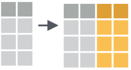
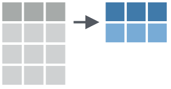

layout: true
class: animated, fadeIn


```{r setup, include=FALSE}
options(htmltools.dir.version = FALSE, htmltools.preserve.raw = FALSE)
library(xaringan)
```

```{r xaringan-themer, include=FALSE, warning=FALSE}
library(xaringanthemer)
style_mono_accent(base_color = "#00746B", 
                  colors = c(red = "#f34213",
                             blue = '#0000ff',
                             purple = "#3e2f5b",
                             orange = "#ff8811",
                             green = "#1d771d",
                             white = "#FFFFFF"))
```

---
## Exploración de datos

.font140[
La exploración de datos se puede incluir dentro del **análisis exploratorio de datos** y persigue un primer grupo de objetivos:

- Conocer la estructura de la tabla de datos y sus tipos de variables
- Detectar observaciones incompletas (valores faltantes)
- Detectar datos con errores e inconsistencias 

Habitualmente hablamos de **_calidad de los datos_** en relación a los items anteriores.

Una segunda etapa nos va servir para conocer la distribución de las variables de interés a partir de: 

- Resumir datos mediante estadísticos y gráficos
- Detectar valores atípicos (outlier)
]
---
## Diagnóstico de datos

.font140[

La etapa diagnóstica comprende:

- el conocimiento de la estructura de la tabla de datos
- la verificación del tipo de dato de cada variable de interés
- la detección de los valores faltantes en las observaciones
- las categorías de las variables cualitativas
- los mínimos y máximos de valores de cada variable cuantitativa

Hay múltiples funciones que se pueden utilizar para cubrir esta etapa y también existen paquetes especiales que se crearon para este fin.

Este diagnóstico es el punto de partida de la depuración de datos, previa a cualquier análisis.

]
---
## Paquetes especificos

.font140[
Vamos a trabajar con dos paquetes especiales que nos permiten hacer este trabajo, aunque dentro del universo de librerías de R vamos a encontrar muchos mas. 

**skimr**

Está diseñado para obtener un resumen rápido de la estructura de tablas de datos y es compatible con el ecosistema tidyverse. 


**dlookr**

Se define como una colección de herramientas que permiten el diagnóstico, la exploración y la transformación de datos. El diagnóstico de datos proporciona información y visualización de valores faltantes, valores atípicos y valores únicos y negativos para ayudarle a comprender la distribución y la calidad de sus datos.

]
---
## skimr

.font140[
La función principal del paquete es `skim` y puede ser aplicada a todo el dataframe o bien a una variable o a un grupo de ellas.
]

```{r, echo=FALSE, warning=F, message=F}
library(skimr)
library(tidyverse)

rita <- read_csv2("assets/rita_prueba.csv", locale = locale(encoding = "UTF-8"))

skim(rita)

```

---
## dlookr

.font140[
El paquete dlookr contiene funciones que nos facilitan el diagnóstico de nuestros datos, además de otras que tienen por objetivo la exploración y transformación de ellos. 

Entre estas funciones encontramos:

`diagnose()` que proporciona información básica de las variables

`diagnose_category()` nos devuelve información detallada de las variables categóricas

`diagnose_numeric()` nos devuelve información detallada de las variables numéricas.

`diagnose_outlier()` y `plot_outlier()` proporciona información y visualización de valores atípicos.

`plot_na_pareto()` construye un diagrama de Pareto mostrando las variables con datos faltantes.

]

---
## diagnose()

```{r, warning=F, message=F, echo=F}
library(dlookr)
library(dplyr)

diagnose(rita) |> 
  mutate(across(where(is.double),~round(.x, digits = 2))) |> 
DT::datatable(
  fillContainer = F, options = list(pageLength = 9))
```

---
## diagnose_category()

```{r, warning=F, message=F, echo=F}

rita |> 
  dplyr::select(IDESTN, TPGFN, MFGN) |> 
diagnose_category() |> 
  mutate(across(where(is.double),~round(.x, digits = 2))) |> 
DT::datatable(
  fillContainer = F, options = list(pageLength = 9))
```
---
## diagnose_numeric()

```{r, warning=F, message=F, echo=F}

rita |> 
  dplyr::select(-NPAMI) |> 
diagnose_numeric() |> 
  mutate(across(where(is.double),~round(.x, digits = 2))) |> 
DT::datatable(
  fillContainer = F, options = list(pageLength = 9))
```
---

## diagnose_outlier()

```{r, warning=F, message=F, echo=F}

rita |> 
  dplyr::select(-NPAMI) |> 
diagnose_outlier() |> 
  mutate(across(where(is.double),~round(.x, digits = 2))) |> 
DT::datatable(
  fillContainer = F, options = list(pageLength = 9))
```
---
## plot_outlier()
.center[
```{r, warning=F, message=F, echo=F, fig.width= 8}

rita |> 
  dplyr::select(DGED) |> 
plot_outlier() 
```
]
---

## plot_na_pareto()

.center[
```{r, warning=F, message=F, echo=F, fig.width= 11}

rita |> 
  select(1:25) |> 
plot_na_pareto() 
```
] 

---
background-image: url(assets/datacleaning.jpg)
background-size: 380px
background-position: 90% 30%

## Depuración de datos

.font140[ 
La etapa de depuración o limpieza de datos comienza con la exploración inicial y el diagnóstico adecuado de cada variable de interés en nuestra tabla.

Luego continúa con las transformaciones necesarias de los datos de la tabla a partir del diagnóstico realizado.

]


```{r,echo=F,  fig.align='center', out.width = "70%"}
knitr::include_graphics("assets/flujo.png")
```

---
## Operaciones simultáneas por columnas 

.font130[
Las operaciones por columnas se refieren a la aplicación de las mismas funciones-verbos de dplyr (u otras funciones de transformación de datos) a varias columnas simultáneamente.
]

.font120[
Ejemplo, creación de múltiples columnas con **mutate()**
]
```{r,echo=F,  out.width = "20%"}

```
.font120[
Ejemplo, resumiendo múltiples columnas con **summarise()**
]
```{r,echo=F,  out.width = "20%"}

```
---
class: left, top


## across()

.font140[
Esta función es la encargada de dar soporte para las operaciones múltiples (*dplyr >= 1.0.0*)
]

.center[.font160[
across(.blue[ .cols],  .orange[ .fns],  .purple[ ...],  .green[ .names])
]]

.font140[
.blue[.cols] = columnas a transformar

.orange[.fns] = función o funciones para aplicar a cada columna de .cols

.purple[...] = argumentos adicionales de las funciones especificadas anteriormente (ejemplo: na.rm = T)

.green[.names] = nombres de las columnas de salida. Aquí, `{col}` es un marcador especial al que se le puede agregar el sufijo deseado.

]

---
# Ejemplo 

.font140[
Utilizamos `across()` para transformar el tipo de datos de POSIX a Date en las fechas de la tabla HPV en solo paso.

]

```{r, echo=T, warning=F, message=F}
rita |> 
  mutate(across(starts_with("FE"),
                dmy)) |> 
  select(where(is.Date))
```

---
## Estadistica descriptiva con rstatix

.font140[
El paquete **rstatix** provee un marco simple e intuitivo compatible con el uso de tuberías, coherente con la filosofía de diseño "tidyverse", para realizar pruebas estadísticas descriptivas básicas y otras más avanzadas de inferencia y modelado.

Las funciones relacionadas con la inferencia estadística, como t-test, ANOVAS, correlaciones y tamaños de efecto, así como también valores p ajustados o agregados de etiquetas de significación no serán explicados en este curso pero aquellxs estudiantes que les interese profundizar y utilizarlas le pueden sacar un provecho muy útil a este paquete. 

El sitio web del paquete es [rstatix](https://rpkgs.datanovia.com/rstatix/index.html)

]

---
## Algunas funciones

.font140[
`get_summary_stats()` devuelve un resumen de estadísticas descriptivas univariadas para variables cuantitativas
]

.font130[
```{r, message=F, warning=F}
library(rstatix)

rita |> 
  get_summary_stats(DGED, type = "common")

```
]
---
## Algunas funciones

.font130[
```{r}
rita |> 
  get_summary_stats(DGED, type = "robust")

rita |> 
  get_summary_stats(DGED, type = "full")
```

]
---
## Algunas funciones

.font140[
`freq_table()` devuelve una tabla de frecuencia absoluta y porcentual de variables cualitativas (se puede combinar más de una) 
]

```{r}
rita |> 
 freq_table(PTEDU)
```


