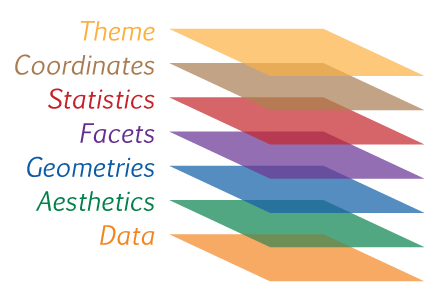

layout: true
class: animated, fadeIn

```{r setup, include=FALSE}
options(htmltools.dir.version = FALSE, htmltools.preserve.raw = FALSE)
library(xaringan)
```

```{r xaringan-themer, include=FALSE, warning=FALSE}
library(xaringanthemer)
style_mono_accent(base_color = "#00746B", 
                  colors = c(red = "#f34213",
  purple = "#3e2f5b",
  orange = "#ff8811",
  green = "#1d771d",
  white = "#FFFFFF"))
```

```{css, echo=F}
.code {
  color: #777;
  width: 48%;
  height: 92%;
  float: left;
}
.plot {
  width: 50%;
  height: 70%;
  float: right;
  padding-left: 1%;
}
```

---
## Temas
<br>
.font150[ 

- Objetivos de la visualización 

- Señales visuales

- Gramática de gráficos

- Paquete / sistema ggplot2

- Cómo funciona el sistema ggplot - paso a paso 

]
---
class: inverse, hide-logo, center, middle

.font180[
“Un simple gráfico ha brindado más información a la mente del analista de datos que cualquier otro dispositivo”. — *John Tukey*
]
---
## Objetivos de la visualización
<br>
<br>
<br>
.font160[


- **Análisis exploratorio**: descubrir y describir patrones en los datos (parte de EDA y de la ciencia de datos)

- **Presentación y comunicación**: capacidad de transmitir el mensaje de forma clara y atractiva. 
]

---
background-image: url(assets/signos.png) 
background-size: 850px
background-position: 50% 75%
## Señales visuales


---
## Gramática de gráficos

.code[.font140[
De manera similar a la gramática lingüística, *"La gramática de gráficos"* define un conjunto de reglas para construir gráficos estadísticos combinando diferentes tipos de capas. 

Esta gramática fue creada por **Leland Wilkinson** (*2005, The Grammar of Graphics (Statistics and Computing). Secaucus, NJ, USA: Springer-Verlag New York, Inc.*)
]]

.plot[
```{r, echo=F}

```

]
---
background-image: url(assets/ggplot2_exploration_es.png) 
background-size: 650px
background-position: 50% 40%

.footnote[[Artwork by @allison_horst](https://twitter.com/allison_horst)]
---
background-image: url(assets/ch-01-correlations-1.png) 
background-size: 650px
background-position: 50% 50%

---
class: left

background-image: url(assets/ggplot2.PNG), url(assets/str_ggplot2.PNG), url(assets/sistema_ggplot2.PNG)
background-size: 160px, 600px, 400px
background-position: 50% 5%, 50% 65%, 50% 95%
<br>
<br>
<br>
<br>
<br>
<br>
.font140[
**ggplot2** es un paquete que se autodefine como librería para _**“crear elegantes visualizaciones de datos usando una gramática de gráficos”**_

El paquete propone un sistema que se basa en la idea que cualquier gráfico se puede construir usando tres componentes básicos:
]
---
## Esquema gráfico ggplot2 
<br>
.font150[
- **Datos** con estructura "ordenada"

]
---
## Esquema gráfico ggplot2 
<br>
.font150[
- **Datos** con estructura "ordenada"

- Mapeo estético (**aes**thetic) de los datos


]
---
## Esquema gráfico ggplot2 
<br>
.font150[
- **Datos** con estructura "ordenada"

- Mapeo estético (**aes**thetic) de los datos

- Objetos **geom**étricos que dan nombre al tipo de gráfico


]
---
## Esquema gráfico ggplot2 
<br>
.font150[
- **Datos** con estructura "ordenada"

- Mapeo estético (**aes**thetic) de los datos

- Objetos **geom**étricos que dan nombre al tipo de gráfico

- **Coord**enadas que organizan los objetos geométricos


]
---
## Esquema gráfico ggplot2 
<br>
.font150[
- **Datos** con estructura "ordenada"

- Mapeo estético (**aes**thetic) de los datos

- Objetos **geom**étricos que dan nombre al tipo de gráfico

- **Coord**enadas que organizan los objetos geométricos

- Escalas (**scale**) definen el rango de valores de las estéticas

]
---
## Esquema gráfico ggplot2 
<br>
.font150[
- **Datos** con estructura "ordenada"

- Mapeo estético (**aes**thetic) de los datos

- Objetos **geom**étricos que dan nombre al tipo de gráfico

- **Coord**enadas que organizan los objetos geométricos

- Escalas (**scale**) definen el rango de valores de las estéticas

- **Facet**as que agrupan en subgráficos
]
---
background-image: url(assets/geoms.png) 
background-size: 900px
background-position: 50% 65%
## Las geometrias definen el tipo de gráfico
---
class: left, top

### gapminder

.font110[ 
**Gapminder Foundation** es una empresa sueca sin fines de lucro que promueve el desarrollo global sostenible y el logro de los **_Objetivos de Desarrollo del Milenio de las Naciones Unidas_** mediante un mayor uso y comprensión de las estadísticas sobre el desarrollo social, económico y ambiental a nivel local, nacional y global.
]

```{r, eval=FALSE}
install.packages(datos)  # instalamos paquete datos

library(datos)  # activamos paquete datos

paises # llamamos al componente paises para visualizar sus datos
```

```{r, echo=FALSE, message=FALSE, warning=FALSE}
library(datos)
library(tidyverse)
paises <- paises |> rename(pib = "pib_per_capita", esp_vida = "esperanza_de_vida")
DT::datatable(data = paises,
  fillContainer = F, options = list(pageLength = 4)
)
```


---
## El esquema básico
<br>
.font160[ 
.content-box-green[
```{r, eval=FALSE}
<DATOS> %>% 
  ggplot(mapping = aes(<MAPEO>)) +
  <GEOM_FUNCION>()
```
]
]
<br>
.font140[ 
```{r, eval=FALSE}
paises %>% 
  ggplot(mapping = aes(x = pib, y = esp_vida)) +
  geom_point()
```
]
---
## Paso a paso
.code[
```{r, eval=FALSE}
paises %>% 
  filter(anio == 2007) %>% 
  ggplot(mapping = aes(x = pib, y = esp_vida)) #<<
```
]

.plot[
```{r, echo=FALSE, out.height="500px"}
paises %>% 
  filter(anio == 2007) %>% 
  ggplot(mapping = aes(x = pib, y = esp_vida)) 
```
]

---
### Elemento geométrico
.code[
```{r, eval=FALSE}
paises %>% 
  filter(anio == 2007) %>% 
  ggplot(mapping = aes(x = pib, y = esp_vida)) +
  geom_point() #<<
```
]

.plot[
```{r, echo=FALSE, out.height="500px"}
paises %>% 
  filter(anio == 2007) %>% 
  ggplot(mapping = aes(x = pib, y = esp_vida)) +
  geom_point()
```
]

---
### Seteo de características (color)
.code[
```{r, eval=FALSE}
paises %>% 
  filter(anio == 2007) %>% 
  ggplot(mapping = aes(x = pib, y = esp_vida)) +
  geom_point(color = "blue") #<<
```
]

.plot[
```{r, echo=FALSE, out.height="500px"}
paises %>% 
  filter(anio == 2007) %>% 
  ggplot(mapping = aes(x = pib, y = esp_vida)) +
  geom_point(color = "blue")
```
]

---
### Mapeo de caracteristicas (color)
.code[
```{r, eval=FALSE}
paises %>% 
  filter(anio == 2007) %>% 
  ggplot(mapping = aes(x = pib, 
                       y = esp_vida, 
                       color = continente)) + #<<
  geom_point()
```
]

.plot[
```{r, echo=FALSE, out.height="500px"}
paises %>% 
  filter(anio == 2007) %>% 
  ggplot(mapping = aes(x = pib,
                       y = esp_vida,
                       color = continente)) +
  geom_point()
```
]
---
### Seteo de características (tamaño)
.code[
```{r, eval=FALSE}
paises %>% 
  filter(anio == 2007) %>% 
  ggplot(mapping = aes(x = pib, 
                       y = esp_vida, 
                       color = continente)) +
  geom_point(size = 3) #<<
```
]

.plot[
```{r, echo=FALSE, out.height="500px"}
paises %>% 
  filter(anio == 2007) %>% 
  ggplot(mapping = aes(x = pib,
                       y = esp_vida,
                       color = continente)) +
  geom_point(size = 3)
```
]
---
### Mapeo de características (tamaño)
.code[
```{r, eval=FALSE}
paises %>% 
  filter(anio == 2007) %>% 
  ggplot(mapping = aes(x = pib, 
                       y = esp_vida, 
                       color = continente,
                       size = poblacion)) + #<<
  geom_point()
```
]

.plot[
```{r, echo=FALSE, out.height="500px"}
paises %>% 
  filter(anio == 2007) %>% 
  ggplot(mapping = aes(x = pib,
                       y = esp_vida,
                       color = continente,
                       size = poblacion)) +
  geom_point()
```
]
---
### Escala de eje
.code[
```{r, eval=FALSE}
paises %>% 
  filter(anio == 2007) %>% 
  ggplot(mapping = aes(x = pib, 
                       y = esp_vida, 
                       color = continente,
                       size = poblacion)) +
  geom_point() +
  scale_y_continuous(breaks = seq(0,90, by = 5)) #<<
```
]

.plot[
```{r, echo=FALSE, out.height="500px"}
paises %>% 
  filter(anio == 2007) %>% 
  ggplot(mapping = aes(x = pib,
                       y = esp_vida,
                       color = continente,
                       size = poblacion)) +
  geom_point() +
  scale_y_continuous(breaks = seq(0,90, by = 5)) 
```
]
---
### Escala de eje (log10)
.code[
```{r, eval=FALSE}
paises %>% 
  filter(anio == 2007) %>% 
  ggplot(mapping = aes(x = pib, 
                       y = esp_vida, 
                       color = continente,
                       size = poblacion)) +
  geom_point() +
  scale_y_continuous(breaks = seq(0,90, by = 5)) +
  scale_x_log10() #<<
```
]

.plot[
```{r, echo=FALSE, out.height="500px"}
paises %>% 
  filter(anio == 2007) %>% 
  ggplot(mapping = aes(x = pib,
                       y = esp_vida,
                       color = continente,
                       size = poblacion)) +
  geom_point() +
  scale_y_continuous(breaks = seq(0,90, by = 5)) +
   scale_x_log10() 
```
]
---
### Escala de color 
.code[
```{r, eval=FALSE}
paises %>% 
  filter(anio == 2007) %>% 
  ggplot(mapping = aes(x = pib, 
                       y = esp_vida, 
                       color = continente,
                       size = poblacion)) +
  geom_point() +
  scale_y_continuous(breaks = seq(0,90, by = 5)) +
  scale_x_log10() +
  scale_color_brewer(palette = "Set1") #<<
```
]

.plot[
```{r, echo=FALSE, out.height="500px"}
paises %>% 
  filter(anio == 2007) %>% 
  ggplot(mapping = aes(x = pib,
                       y = esp_vida,
                       color = continente,
                       size = poblacion)) +
  geom_point() +
  scale_y_continuous(breaks = seq(0,90, by = 5)) +
  scale_x_log10() +
  scale_color_brewer(palette = "Set1")
```
]
---
### Etiquetas de ejes y tema

.code[
```{r, eval=FALSE}
paises %>% 
  filter(anio == 2007) %>% 
  ggplot(mapping = aes(x = pib, 
                       y = esp_vida, 
                       color = continente,
                       size = poblacion)) +
  geom_point() +
  scale_y_continuous(breaks = seq(0,90, by = 5)) +
  scale_x_log10() +
  scale_color_brewer(palette = "Set1") +
  ylab("Esperanza de vida (años)") +  #<<
  xlab("PBI per capita") + #<<
  theme_bw() #<<
```
]

.plot[
```{r, echo=FALSE, out.height="500px"}
paises %>% 
  filter(anio == 2007) %>% 
  ggplot(mapping = aes(x = pib,
                       y = esp_vida,
                       color = continente,
                       size = poblacion)) +
  geom_point() +
  scale_y_continuous(breaks = seq(0,90, by = 5)) +
  scale_color_brewer(palette = "Set1") +
  scale_x_log10()  +
  ylab("Esperanza de vida (años)") + 
  xlab("PBI per capita") +
  theme_bw()
```
]
---
### Facetas

.code[
```{r, eval=FALSE}
paises %>% 
  ggplot(mapping = aes(x = pib, 
                       y = esp_vida, 
                       color = continente,
                       size = poblacion)) +
  geom_point() +
  scale_y_continuous(breaks = seq(0,90, by = 5)) +
  scale_x_log10() +
  scale_color_brewer(palette = "Set1") +
  ylab("Esperanza de vida (años)") +  
  xlab("PBI per capita") + 
  theme_bw() +
  facet_wrap(anio ~ .)#<<
```
]

.plot[
```{r, echo=FALSE, out.height="500px"}
paises %>% 
  ggplot(mapping = aes(x = pib,
                       y = esp_vida,
                       color = continente,
                       size = poblacion)) +
  geom_point() +
  scale_y_continuous(breaks = seq(0,90, by = 5)) +
  scale_x_log10() +
  scale_color_brewer(palette = "Set1") +
  ylab("Esperanza de vida (años)") + 
  xlab("PBI per capita") +
  theme_bw() +
  facet_wrap(anio~.)
```
]
---
### Estéticas globales vs locales

.bold[.font130[Definición de aes() global:]]

.code[ 
```{r, eval=FALSE, message=F, warning=FALSE}
paises %>% 
  filter(anio == 2007, 
         continente %in% c("África", 
                           "Europa")) %>% 
  ggplot(aes(x = pib,
             y = esp_vida,
             color = continente)) + #<<
  geom_point() +
  geom_smooth()
```
]


.plot[ 
```{r, echo=FALSE, fig.retina=3, message=F, warning=FALSE}
paises %>% 
  filter(anio == 2007, 
         continente %in% c("África", 
                           "Europa")) %>% 
  ggplot(aes(x = pib,   
             y = esp_vida, 
             color = continente)) + 
  geom_point() +
  geom_smooth()
```
]

---

### Estéticas globales vs locales

.bold[.font130[Definición de aes() local:]]

.code[ 
```{r, eval=FALSE, message=F, warning=FALSE, fig.retina=3}
paises %>% 
  filter(anio == 2007, 
         continente %in% c("África", 
                           "Europa")) %>% 
  ggplot(aes(x = pib,   
             y = esp_vida)) + 
  geom_point(aes(color = continente)) + #<<
  geom_smooth(color = "blue")
```
]

.plot[ 
```{r, echo=FALSE, message=F, warning=FALSE, fig.retina=3}
paises %>% 
  filter(anio == 2007, 
         continente %in% c("África", 
                           "Europa")) %>% 
  ggplot(aes(x = pib,   
             y = esp_vida)) + 
  geom_point(aes(color = continente)) + #<<
  geom_smooth(color = "blue")
```
]

---
background-image: url(assets/ggplot2_obra_maestra.png) 
background-size: 700px
background-position: 50% 40%

.footnote[[Artwork by @allison_horst](https://twitter.com/allison_horst)]
---
### Exportar gráficos de ggplot2

.font120[ 
- Desde el **_panel Plot_** de .bold[RStudio]

- En formatos conocidos como JPG, PNG, PDF, etc

- Mayor control con la función **_ggsave()_**

```{r, eval=FALSE}
ggsave(filename,               # nombre del archivo
  plot = last_plot(),          # nombre del objeto gráfico
  device = NULL,               # formato de salida "jpeg", "png", "tiff", "pdf", etc
  width = NA,                  # ancho en unidades de units
  height = NA,                 # alto en unidades de units
  units = c("in", "cm", "mm"), # unidades de medidas
  dpi = 300)                   # resolución de salida en dpi
```
]

---
background-image: url(assets/visualization.svg) 
background-size: 550px
background-position: 50% 50%

## En resumen...

.footnote[Copyright (c) RStudio - [Licencia Creative Commons]( http://creativecommons.org/licenses/by/4.0/)]


---

## Enlaces sobre graficos y ggplot2
<br>
.font140[

- Sitio web oficial de [ggplot2](https://ggplot2.tidyverse.org/)

- Visualización de datos [Data to viz](https://www.data-to-viz.com/)

- [Extensiones de ggplot2](https://exts.ggplot2.tidyverse.org/gallery/)

- Data visualization - Kieran Healy [Libro online](https://socviz.co/index.html)

- Fundamentals of Data Visualization - Claus O. Wilke [Libro online](https://clauswilke.com/dataviz/)

]
---
background-image: url(assets/final.PNG) 
background-size: 900px
background-position: 50% 50%
